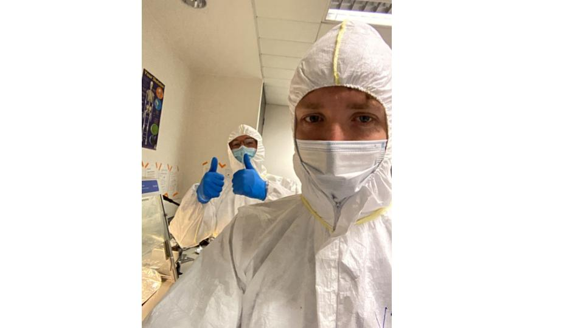{width="100%" style="border-radius: 6px;"}

---

## Group Leader: Kevin Daly

::: columns
::: {.column width="65%"}

I am a Lecturer/Assistant Professor at UCD's School of Agriculture and Food Science, where I lead the "Ruminant Palaeogenomics" group.

I completed my undergraduate at Trinity College Dublin, where I began my academic career under the mentorship of Prof. Daniel Bradley. As part of Dan's ERC project "CODEX" I generated the [first large-scale genomic dataset of an ancient livestock](https://www.science.org/doi/10.1126/science.aas9411), thus beginning my healthy research interest in goats.

Following my PhD I had the fortune to collaborate with Dr. Melinda Zeder on material from Ganj Dareh, one of the earliest settlements with robust evidence for goat management. Expanding the dataset with Dr. Marjan Mashkour, Dr. Pernille Bangsgaard, and Dr. Lisa Yeoman, we created a multi-disciplinary collaboration on the world's oldest managed goat herds, producing [a study I am very proud of](https://www.pnas.org/doi/10.1073/pnas.2100901118).

I have also explored the genomics of ancient sheep — a species arguably more important than goats, if perhaps less charismatic. [See here](https://royalsocietypublishing.org/doi/full/10.1098/rsbl.2021.0222?rfr_dat=cr_pub++0pubmed&url_ver=Z39.88-2003&rfr_id=ori%3Arid%3Acrossref.org) for a sheep mummy genome from a specimen we initially thought was a goat, led by the peerless Dr. Conor Rossi.

More recently I have been awarded an ERC Starter award to explore how livestock and their pathogens have coevolved: [HERDPATH](https://cordis.europa.eu/project/id/101220382). Previously I led a [SFI Pathways award](https://www.tcd.ie/news_events/articles/trinity-researchers-secure-eight-sfi-irc-pathway-awards/) to explore small ruminant pathogens in the earliest phases of livestock domestication. I am a member of the first cohort of the [Young Academy of Ireland](https://www.ria.ie/kevin-gerard-daly), the least among an [exceptional group](https://www.ria.ie/bios/young-academy-ireland/all) of young researchers and leaders.

I am a proponent of alternative peer review publishing models and have [submitted manuscripts](https://genomics.peercommunityin.org/articles/rec?id=162) through the "Peer Community In" system. I look forward to doing so again and hope to support the movement however I can.

In my free time I watch films and maintain a list of [the best goat roles in cinema](https://boxd.it/4BHse). You won't believe what's at number one.

:::
::: {.column width="5%"}
:::
::: {.column width="30%"}

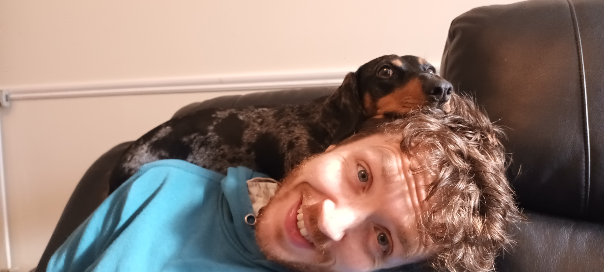{width="100%" style="border-radius: 4px;"}

*A standard working from home day.*

:::
:::

::: {layout-ncol=2}
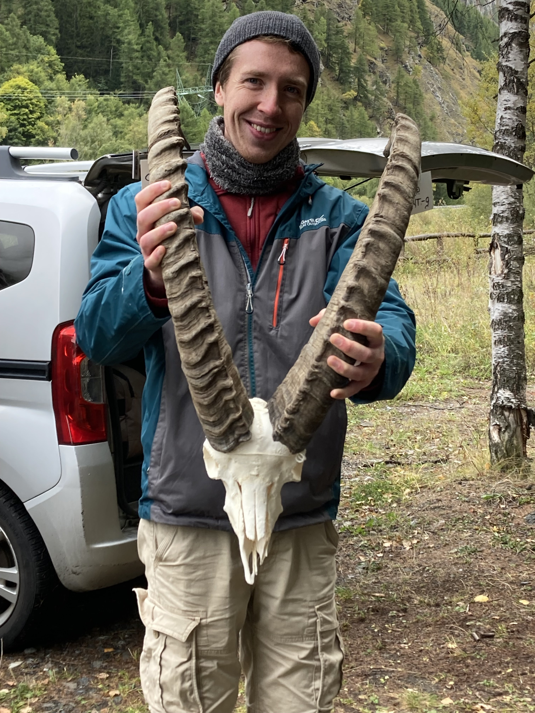

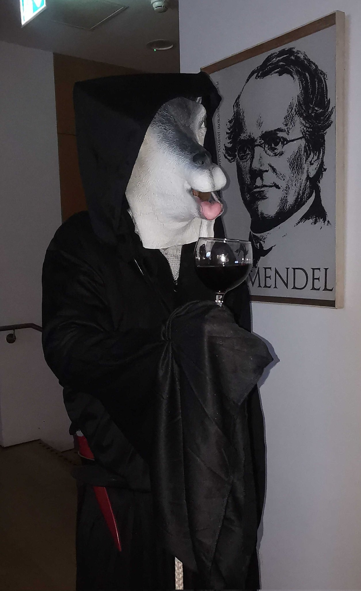
:::

---

## Postdoctoral Researchers

### Jolijn Erven

::: columns
::: {.column width="65%"}

I'm Jolijn Erven, a Postdoc in the Ruminant Palaeogenomics group. I completed my master's training in genetics at Wageningen University, where I developed a fascination with animal domestication, evolution, and behaviour.

This led me to pursue a PhD at the Groningen Institute of Archaeology as part of the EDAN project, where I focused on the domestication of cattle and pigs in the Netherlands — and more broadly, Europe — using palaeogenomics to understand how early communities shaped, and were shaped by, the animals they lived alongside.

I am currently exploring the demographic history of domestic goats by studying early herding societies and dispersal from early domestication centres. I'm particularly keen on using every tool in our bioinformatics toolbox to understand demographic shifts and evolutionary processes throughout the past.

I'm especially interested in multidisciplinary approaches — drawing from various fields to trace the origins and adaptations of domestic animals. More broadly, I'm curious about how animals evolve in response to human or natural environments, and how behaviour, ecology, and genetics intersect in that story.

When I'm not in the lab or wrangling data, I love sharing quirky animal trivia — or just talking your ears off about animals and/or bioinformatics tools.

:::
::: {.column width="5%"}
:::
::: {.column width="30%"}

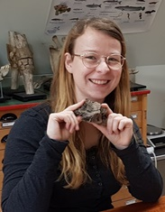{width="100%" style="border-radius: 4px;"}

:::
:::

::: {layout-ncol=2}
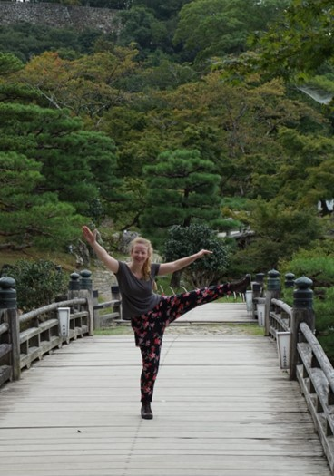

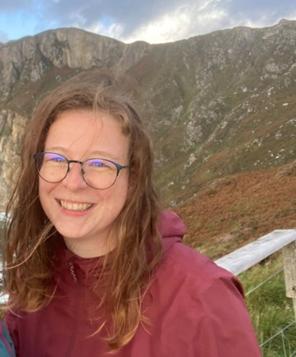
:::

---

## PhD Students

### Louis L'Hôte

::: columns
::: {.column width="100%"}

I am Louis, a PhD student in ancient pathogen genetics. After an undergraduate degree in life sciences, I pursued a Master's in Engineering in Microbiology at the [Faculté des sciences et technologies, Université de Lorraine](https://fst.univ-lorraine.fr/).

During my master's I joined two research projects: in 2021 I worked on ancient woolly mammoth microbiota at the [Microbial Palaeogenomics Unit](https://research.pasteur.fr/en/team/microbial-paleogenomics/) at the Pasteur Institute in Paris, gaining extensive experience in metagenomics and ancient DNA. In 2022 I completed my master's thesis in Copenhagen at the [Centre for ExoLife Sciences](https://cels.nbi.ku.dk/english) (CELS), using metagenomics and metatranscriptomics to understand how microbes survive in Mars-like extreme environments.

I am currently Kevin Daly's PhD student and part of the SFI Pathways project *"Herd Health"*. Livestock animals were domesticated 10,000 years ago in southwest Asia, but little is known about their health — inbreeding, infectious disease — despite their central role in early farming societies. Recent advances in next-generation sequencing have made it possible to reconstruct ancient human pathogen genomes (e.g. *Yersinia pestis*, the agent of the Black Death) from archaeological specimens, but equivalent work on livestock pathogens remains rare.

My work focuses on recovering pathogen and animal DNA from 10,000-year-old sheep and goat remains from the Zagros Mountains in Iran, to understand how zoonotic pathogen evolution was shaped by the onset of domestication. I'm interested in everything to do with microbes — from ancient DNA to wet lab.

:::
::: {.column width="5%"}
:::
::: {.column width="30%"}

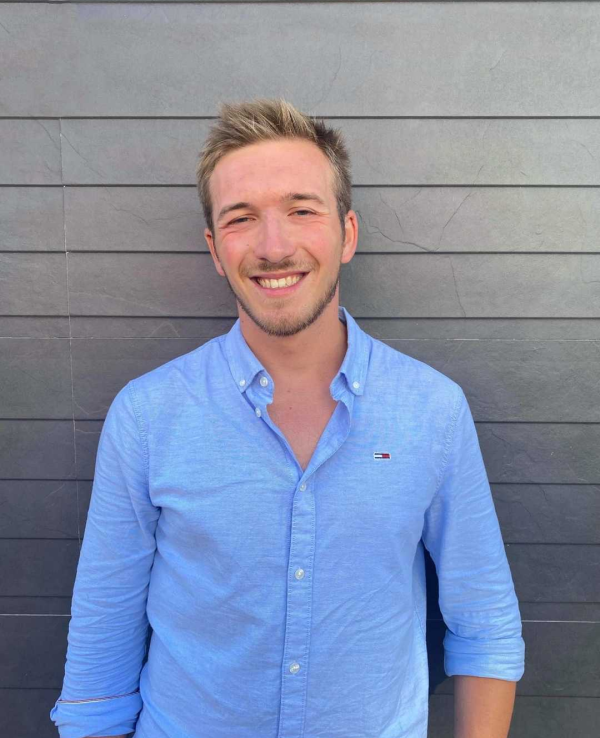{width="100%" style="border-radius: 4px;"}

:::
:::

::: {layout-ncol=2}
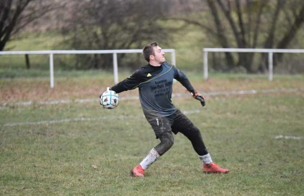

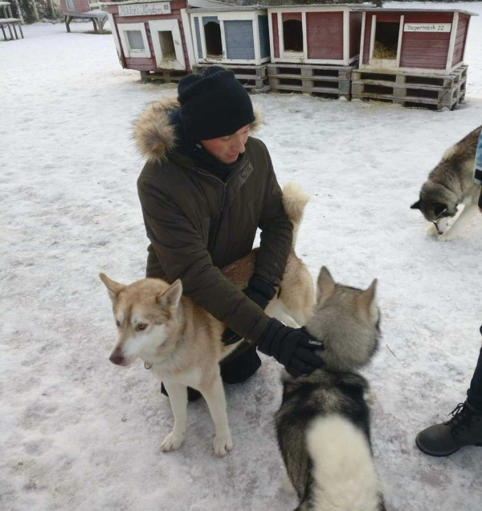
:::

---

### Luisa Sacristán

::: columns
::: {.column width="65%"}

¡Hola! I'm Luisa, and since 2025 I've been a PhD student in Kevin Daly's Ruminant Palaeogenomics group at UCD.

I completed my undergraduate degree in Microbiology at the Universidad de Pamplona, Colombia, and worked for three years as a quality control microbiologist. In 2020 I joined [Gencore](https://corefacilities.uniandes.edu.co/gencore/), a sequencing core facility at Universidad de los Andes, participating in projects sequencing a wide variety of organisms. During the pandemic I contributed to the [COVIDA](https://www.uniandes.edu.co/es/node/12511) project and to genomic surveillance of SARS-CoV-2 variants in collaboration with Colombia's National Institute of Health.

The challenge of generating biological data without knowing how to analyse it motivated me to pursue a Master's in Computational Biology at Universidad de los Andes in 2022, joining the [Computational Biology and Microbial Ecology (BCEM)](https://bcem-uniandes.github.io/) group. There I developed a low-cost protocol for full operon sequencing using ONT technology, and conducted my thesis research — as part of the [Beasts to Craft](https://sites.google.com/palaeome.org/ercb2c/home) project — on metagenomic analysis of bacterial communities in historical parchment manuscripts.

After completing my master's, I joined the [CABANA project](https://cabana.network/elearning) in 2024, developing bioinformatics e-learning courses in Spanish and English to reduce language barriers in Latin America.

My PhD project aims to study the co-evolution of livestock and their pathogens by analysing recovered pathogen genomes and their host animals. *(More details coming soon!)*

:::
::: {.column width="5%"}
:::
::: {.column width="30%"}

{width="100%" style="border-radius: 4px;"}

{width="100%" style="border-radius: 4px; margin-top: 1rem;"}

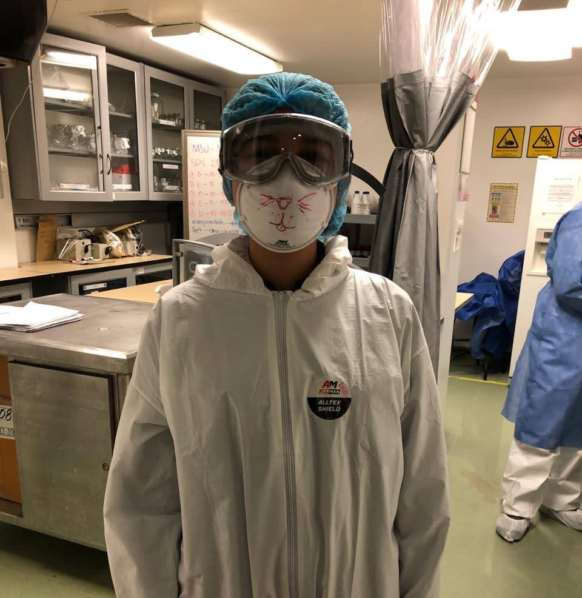{width="100%" style="border-radius: 4px; margin-top: 1rem;"}

:::
:::

---

### Xinyi Li

::: columns
::: {.column width="65%"}

Hello, I'm Xinyi Li. In 2025 I joined Kevin Daly's Ruminant Palaeogenomics group as a PhD student. I am also a jointly-trained PhD student at the Institute of Animal Science, CAAS, under the supervision of Professor Zhangyuan Pan, whose research focuses on genetic breeding of sheep and goats and epigenomics.

From 2022 to 2025 I completed my master's at the Institute of Animal Science with a major in Animal Genetics, Breeding and Reproduction. I participated in research on pigeon genetic breeding and conducted population genetic studies on the pigeon genome — work that sparked my deep interest in bioinformatics and animal evolutionary history.

Currently I am contributing to research on functional annotation of sheep epigenomics in Professor Pan's group in China, and will be coming to Ireland to complete my PhD work. My project aims to analyse the evolution of epigenetic regulatory elements in ruminants, with the hope of extracting meaningful information from ancient DNA.

:::
::: {.column width="5%"}
:::
::: {.column width="30%"}

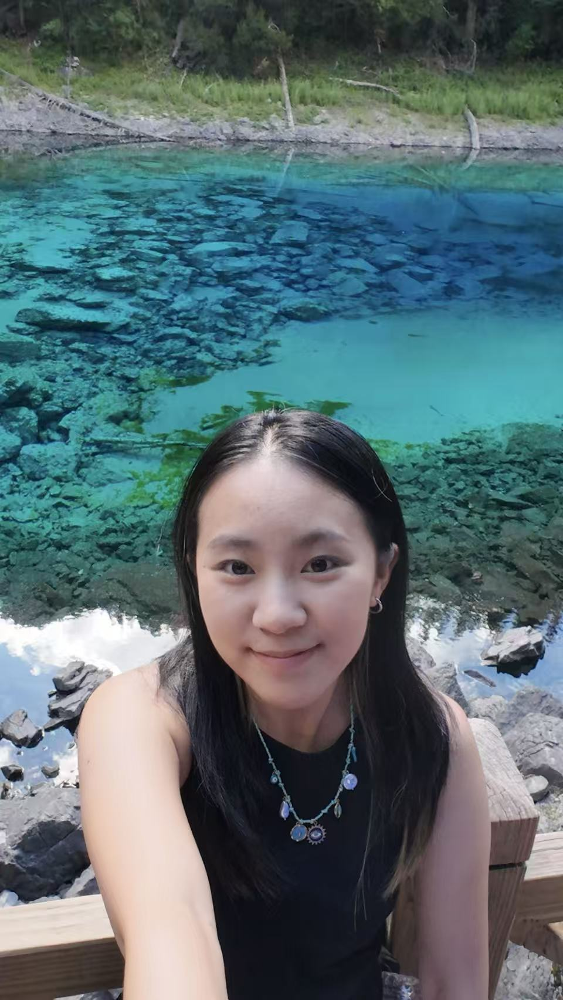{width="100%" style="border-radius: 4px;"}

:::
:::

::: {layout-ncol=2}
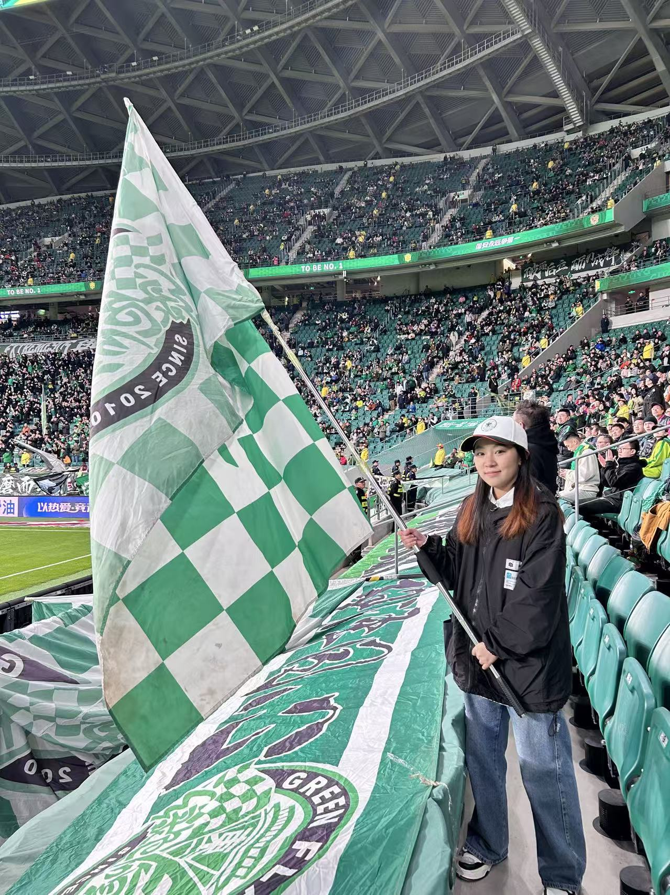

:::

---

### Jules Berardini

::: columns
::: {.column width="65%"}

I am a doctoral student in the Ruminant Paleogenomics group, working within Kevin Daly’s HEARDPATH ERC, to evaluate the impact of domestication and continued anthropogenic management on the genomic health of sheep and goats. 

I received my undergraduate degree from the University of Toronto, double majoring in Evolutionary Biology and Molecular Genetics, and minoring in Archaeology. During this time, I completed an independent research project (the Canadian approximation of a Bachelor’s thesis) within the Wilde Lab focusing on characterizing isoforms of the structural actin protein in nematode worms. 

In the pursuit of synthesizing my research interests, and satiating an ever-present thirst for understanding the long intertwined relationships between humans and non-human animals, I undertook a Master's degree in Palaeogenetics at the University of Tübingen as part of the ASHE program. Working in the Posth Lab, I analyzed a set of wooly rhinoceros genomes from the species' poorly characterized western range, in order to understand its evolution and extinction. In this time, I became increasingly fascinated with the phenomenon of megaherbivore extinction and the ultimate (though arguably impartial) replacement of their ecological roles by agricultural humans, inclusive of the rise of domesticate ruminant populations. 

Within my PhD, I hope to use an interdisciplinary approach to interpret genetic data — integrating archaeological and ethnographic sources alongside bioinformatic analysis to inform on how migration, economics, climate, and husbandry practice have impacted herd welfare, species adaptation, and breed development in different periods and places.”

:::
::: {.column width="5%"}
:::
::: {.column width="30%"}

:::
:::

::: {layout-ncol=2}
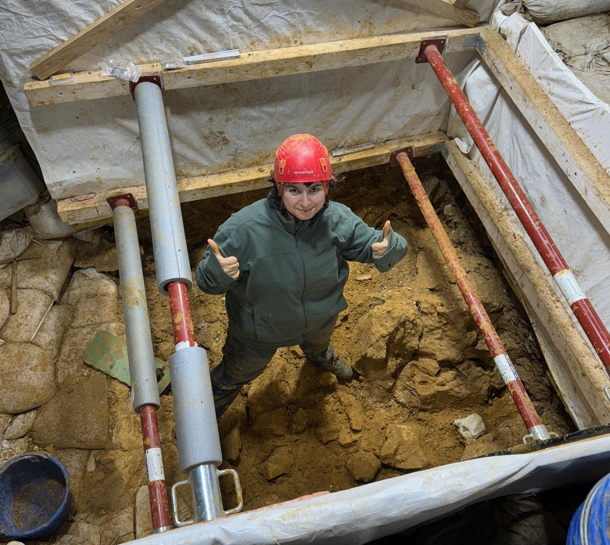

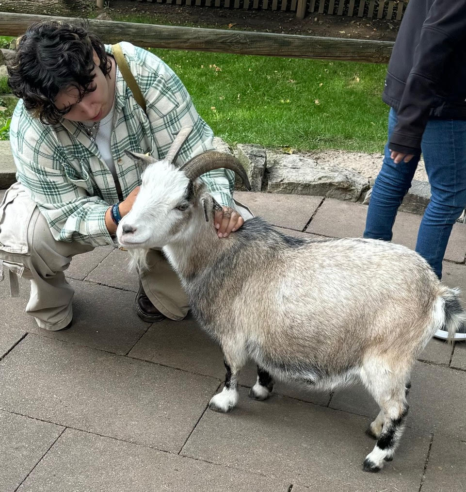
:::
:::
