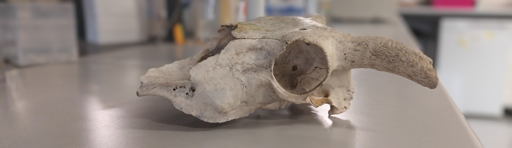
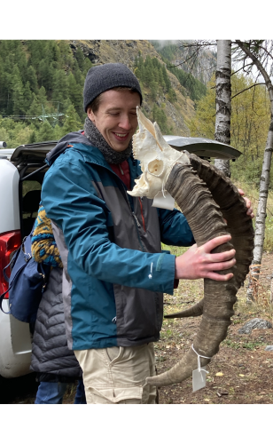
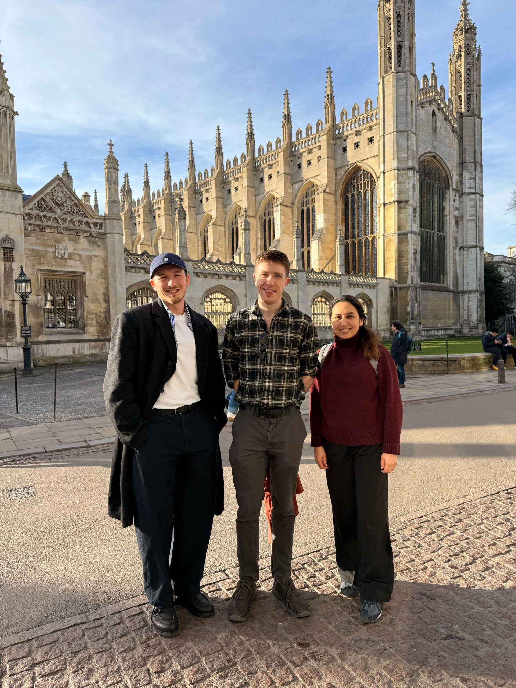

{width="100%" style="border-radius: 6px; margin-bottom: 0.5rem;"}

## Hello!

::: columns
::: {.column width="65%"}

My group investigates the consequences of ruminant domestication and human activity on animal genomes across millennia.

We use **palaeogenomics** — genome data recovered from thousands-of-years-old bones, teeth, and other archaeological materials — to reconstruct the deep past.

With these ancient genomes, we can peer back into prehistory to track how animals evolved, document past patterns of biodiversity, and reveal the forces that shaped modern animal diversity — including the critical transition from wild to domestic.

:::
::: {.column width="5%"}
:::
::: {.column width="30%"}

{fig-align="center" style="border-radius: 50%; border: 3px solid #ddd;"}

**Kevin G. Daly**  
*Principal Investigator*  
UCD School of Agriculture and Food Science

:::
:::

---

## Who we are

::: columns
::: {.column width="55%"}

From February 2024, our research group at University College Dublin has been exploring the deep history of ancient animal genetic diversity, health, and pathogens — and how all three were shaped by domestication and human activity.

The group includes **Jolijn Erven**, **Louis L'Hôte**, **Luisa Sacristán**, and **Xinyi Li**. Together we work on the SFI Pathways project *"Herd Health"*, focusing on sheep and goats — small ruminants first domesticated in Southwest Asia roughly 10,000 years ago.

Our work sits at the intersection of genomics, archaeology, veterinary science, and evolutionary biology.

:::
::: {.column width="5%"}
:::
::: {.column width="40%"}

{style="border-radius: 4px;"}

:::
:::

---

## ERC Starter Award: HERDPATH

> *Transforming our understanding of how livestock domestication shaped herd and pathogen evolution over the past 10,000 years.*

HERDPATH uses cutting-edge palaeogenomic approaches to analyse ancient DNA from archaeological livestock remains — focusing on sheep and goat but drawing on data from other species — across Eurasia, to reveal the dynamic interplay between domestication, pathogen evolution, herd inbreeding, and immune gene variation.

**Why this matters**

Genetic analysis from ancient animal remains has already revealed the dynamics of the early domestication process (Daly et al. 2018, 2021, 2025; Verdugo et al. 2019). However, three major questions remain open:

- **Genomic health of domesticates** — how did reductions in genetic diversity during domestication affect animal resilience to infectious disease?
- **Pathogen co-evolution** — ancient genomic analysis has begun to illuminate zoonotic pathogen histories (Key et al. 2020; L'Hôte et al. 2024; Light-Maka et al. 2025), but how these evolved alongside domestic animal hosts is largely unknown.
- **Adaptive immunity** — how have livestock adapted genetically to infectious disease threats, and how has inbreeding affected herd susceptibility over time?

**Our approach**

The project will generate sequencing data from a diverse range of sheep and goat archaeological remains spanning the last 10,000 years. Recovered DNA from both host and pathogen sources will be used to reconstruct genomes and chart the interlinked evolution of domestic ruminants and their pathogens — both zoonotic and livestock-specific — drawing from genomics, microbial evolution, archaeology, zooarchaeology, and veterinary science.
