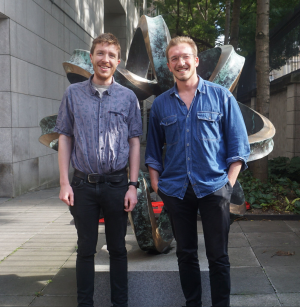

   

## **Hello!**
::: columns
::: column
   
My group's research interests are the consequences of ruminant domestication and human activity.
   
We study this using palaeogenomics - genome data recovered from thousands of years old bones, teeth, and other materials. 
   
With these ancient genomes, we can peek back into prehistory to see how animals have evolved, what were past patterns of biodiversity and how they have changed, and the forces shaping modern animal diversity.
:::

::: column
{fig-align="center"}
:::
:::
## **Who we are**

::: columns
::: column
From February 2024 I have set up a research group at University College Dublin, in the UCD School of Agriculture and Food Science. 
   
Together with my Jolijn Erven, Louis L'Hôte, Luisa Sacristán, and Xinyi Li we are exploring the deep history of ancient animal genetic diversity, health, pathogens and how both were shaped by domestication and human activity as part of the SFI Pathways project "Herd Health". In particular we focus on sheep and goats - small ruminants domesticated in Southwest Asia roughly 10,000 years ago.
:::

::: column

:::
:::

##  ERC Starter Award project: HERDPATH

HERDPATH is an ambitious project aiming to transform our understanding of how livestock domestication and management shaped both herd and pathogen evolution over the past 10,000 years. Using cutting-edge palaeogenomic approaches, we will analyse ancient DNA from archaeological livestock remains - focusing on sheep and goat but drawing on data from other species - across Eurasia to reveal the dynamic interplay between domestication, pathogen evolution, herd inbreeding, and immune gene variation. 
  

Genetic analysis from ancient animal remains has revealed the dynamics of the early domestication process (e.g. Daly et al 2018 and 2025; Daly et al, 2021; Verdugo et al, 2019). However, little is known about the genomic health of domesticates - the reduction in genetic diversity which may have occurred throughout domestication and its possible consequences to animal resilience to infectious disease. Similarly, ancient genomic analysis has begun to shed light on the genetic history of human pathogens, including some zoonotic agents (e.g. Key et al, 2020; L’Hôte al al. 2024; Light-Maka et al, 2025), but how such zoonoses evolved with their domestic animal hosts is unknown. How livestock-specific pathogens evolved and adapted to their host species is relatively underexplored. Finally, little is understood of the adaptive process in livestock species themselves to these infectious disease threats, and how trends in genetic diversity and inbreeding may have affected herd susceptibility.
  
The project will generate sequencing data from a diverse range of sheep and goat archaeological remains over the last 10,000 years. Recovered DNA from both host and pathogen sources will be used to reconstruct genomes and chart the interlinked evolution and genetic flux of domestic ruminants and their pathogens, both zoonotic and livestock-specific. The project will involve drawing from multiple disciplines and lines of evidence including genomics, microbial/pathogen evolution, archaeology and zooarchaeology, zoology/veterinary science.
  
